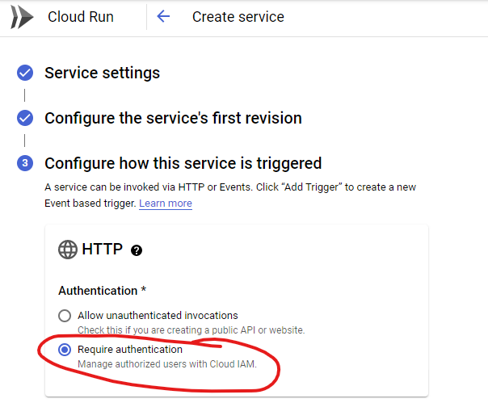

# Authenticated gRPC with C# on CloudRun 

This sample code demonstrates how to create a simple .NET Core 5 C# gRPC server and client.  

## Authentication
The server is deployed to Google CloudRun and uses *"Require authentication"* with TLS.  CloudRun handles TLS termination so it is important that the server implementation listens on port 80 **without TLS**.

### Prerequisites
1. Clone this repo locally.
1. Create a project and enable the CloudRun API from [here](https://console.cloud.google.com/flows/enableapi?apiid=run.googleapis.com)
1. See the docs on [.NET development environment](https://cloud.google.com/dotnet/docs/setup) instructions to setup a service account, download a service acount key and create the ```GOOGLE_APPLICATION_CREDENTIALS``` environment variable that will be used by the client to connect.
    * Set the environment variable ```GOOGLE_PROJECT_ID``` to the project id you just created.
1. Follow [these steps](https://cloud.google.com/container-registry/docs/quickstart) to enable the container registry and configure docker authentication so that you can push an image.

### Deploy the server

1. Build the server container by executing:
    ```bash 
    docker build --force-rm --no-cache -t gcr.io/$GOOGLE_PROJECT_ID/mygrpc:v1 -f Dockerfile .
    ```
1. Push the container to your registry:
    ```bash 
    docker push gcr.io/$GOOGLE_PROJECT_ID/mygrpc:v1
    ```
1. Create the new CloudRun service
    ```bash
    gcloud run deploy mygrpc --region us-central1 --platform managed \
        --image gcr.io/$GOOGLE_PROJECT_ID/mygrpc:v1 --port 80 --no-allow-unauthenticated
    
    ...

    Service URL: https://mygrpc-xxxxxxxxxx.a.run.app
    ```
1. Take note of the **Service URL** that was created above.

    * Alternatively you can deploy using the console and choose **Require authentication**

        
1. Ensure that your service account has the ```roles/run.invoker``` role for your CloudRun.
    ```bash
    gcloud run services add-iam-policy-binding mygrpc \
        --member="[YOUR_GOOGLE_SERVICE_ACCOUNT]" \
        --role="roles/run.invoker"
    ```

### Run the client locally

The client requires 2 parameters:
* Service URL (from above)
* The reply name you want the server to return with (simple concatination).
```bash
# Change into the client directory
cd ./client

# Execute the client app
dotnet run -- https://mygrpc-xxxxxxxxxx.a.run.app Jason

# You should see this reply:
Greeting Hello Jason
```
